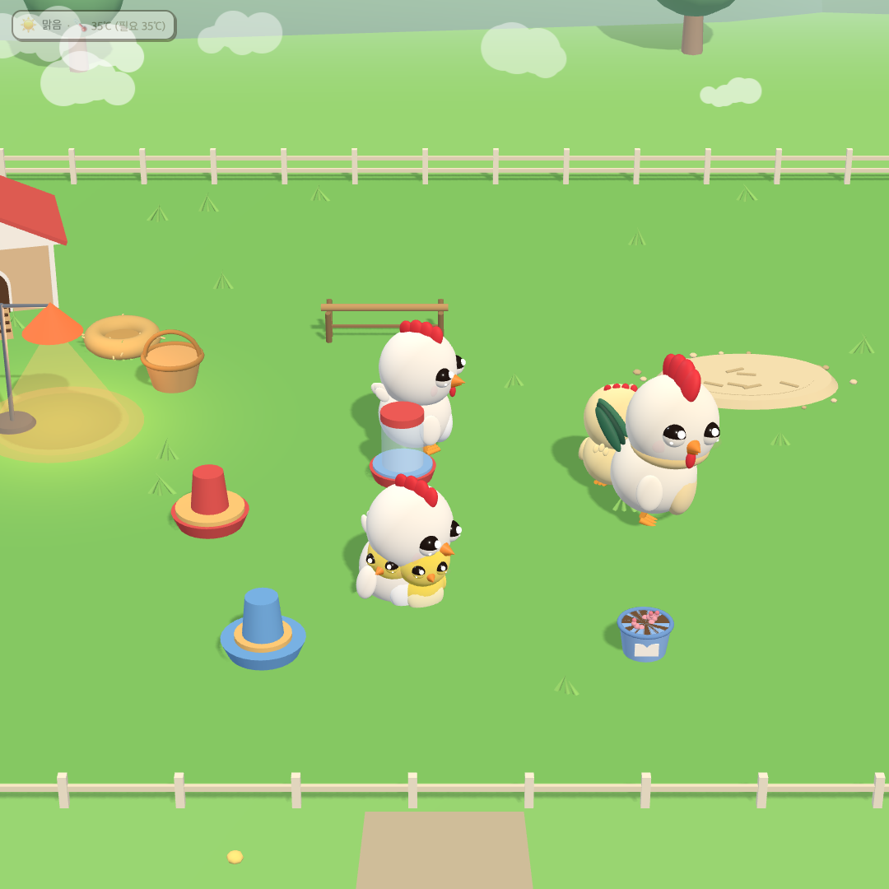
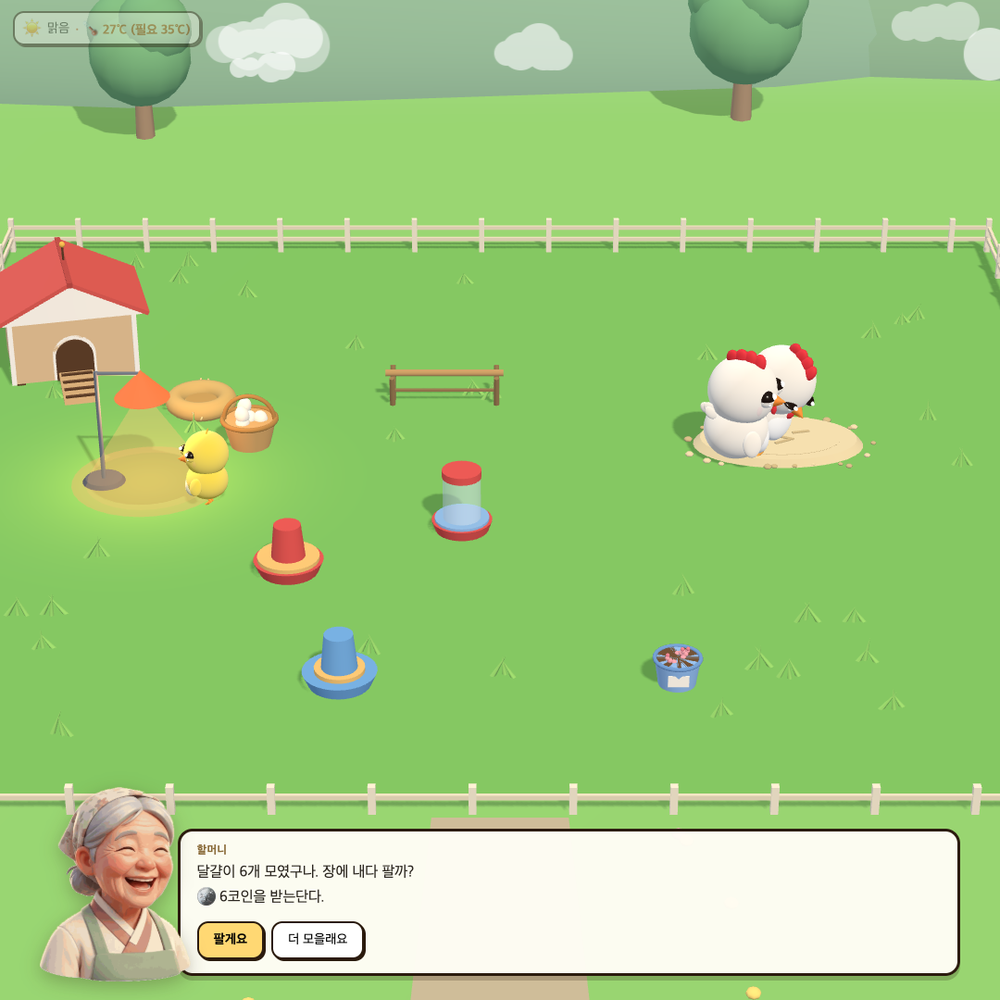
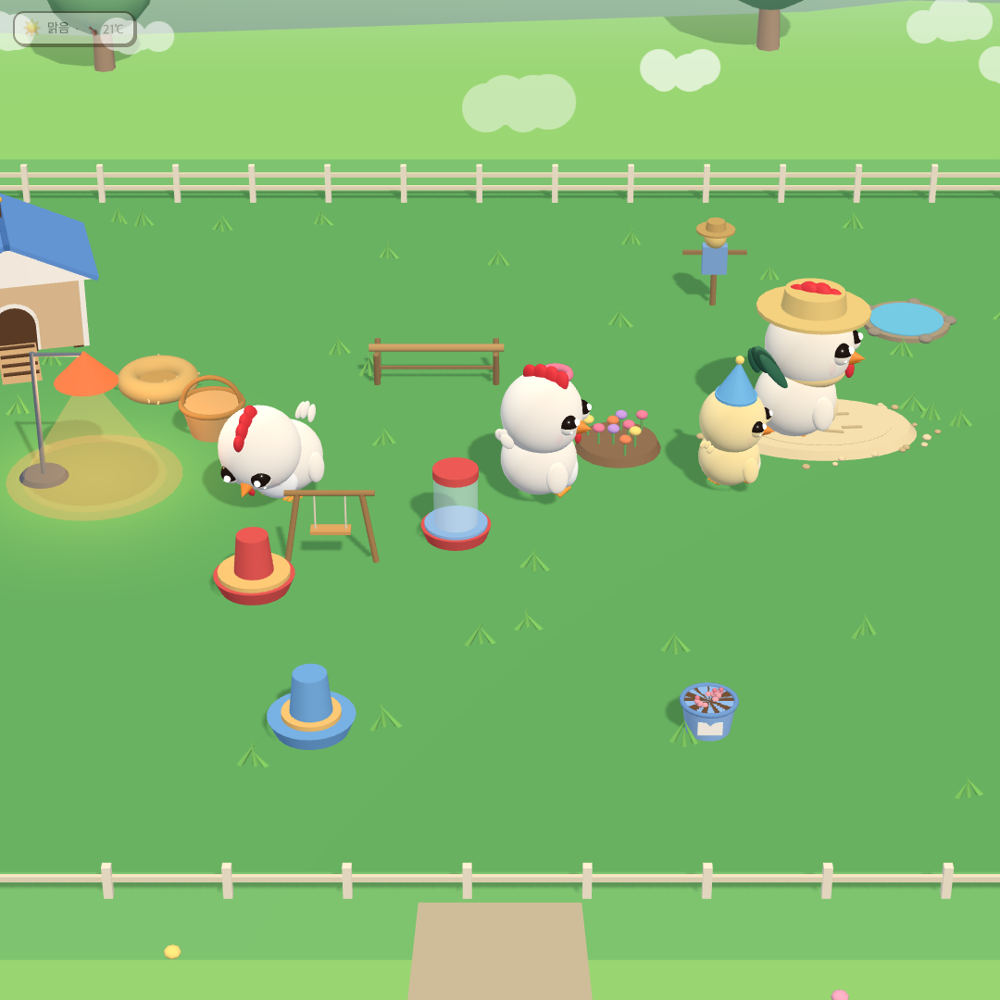
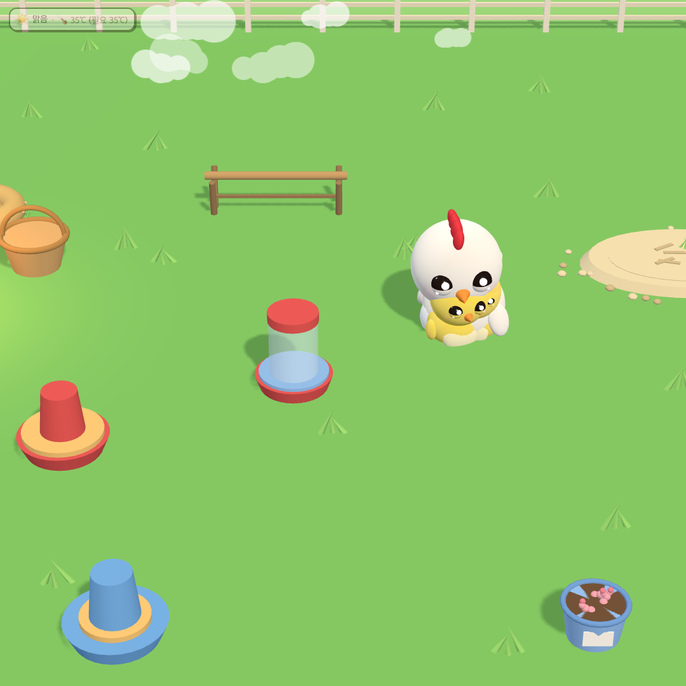

# 🐣 티처펫 — 병아리를 부탁해

> 할머니가 알 하나를 건네며 말씀하십니다. **"이 아이는 네가 맡아 보렴."**

초등학생이 병아리를 알에서 어른 닭이 될 때까지 키우며 **닭의 한살이**와 **생명을 돌보는 책임**을 배우는 웹 게임입니다.
농장 시리즈 6편 가운데 1편입니다.

**👉 바로 해 보기: https://kang-t.github.io/teacherpet/**

설치도, 회원가입도, 로그인도 없습니다. 크롬북·집 컴퓨터의 크롬에서 주소만 열면 됩니다.

| | |
|---|---|
|  |  |
| 엄마 닭이 깨어난 병아리를 날개 밑에 품습니다 | 달걀은 할머니께 팔아 용돈이 됩니다 |
|  |  |
| 돌본 날이 쌓이면 마당을 꾸밉니다 | 가까이 보면 표정이 보입니다 |

---

## 무엇을 하나요

| | |
|---|---|
| 🥚 **알에서 어른까지** | 알 → 병아리 → 중병아리 → 닭. 하루에 조금씩 자랍니다. 기다림도 배움입니다. |
| 🐥 **살아 있는 닭** | 닭마다 성격이 다릅니다(20종). 배고프면 졸졸 따라다니며 보채고, 벌레를 쫓아가 잡고, 커서가 궁금하면 다가와 쪼아 봅니다. |
| 🌡 **진짜처럼 돌보기** | 어린 병아리는 보온등 아래에 있어야 합니다. 나이에 맞는 사료(어린 병아리용 / 중병아리용)를 모이통 두 개에 따로 줍니다. |
| 🐔 **엄마 닭** | 암탉이 알을 품고, 깨어난 병아리를 날개 밑에 다시 품어 줍니다. 품긴 병아리는 보온등 없이도 따뜻합니다. |
| ☀️ **오늘의 날씨** | 날짜와 반 번호로 정해지는 날씨. 같은 반 아이들은 같은 날 같은 날씨를 봅니다. (실제 날씨 정보를 가져오지 않습니다.) |
| 🧺 **달걀과 용돈** | 잘 돌본 날이 쌓이면 할머니가 용돈을 주시고, 달걀 바구니를 눌러 달걀을 팔 수 있습니다. |
| 🎩 **꾸미기** | 모자, 닭장, 마당 장식, 바닥. 꾸미기만 있고 뽑기는 없습니다. 돈으로 닭이 강해지지 않습니다. |
| 💌 **할머니께 편지** | 고치고 싶은 것, 있었으면 하는 것을 할머니께 보낼 수 있습니다. |

### 조작

- **닭 클릭** — 쓰다듬기
- **모이통 클릭** — 그 통만 채우기 · **오른쪽 클릭** — 사료 바꾸기
- **달걀 바구니 클릭** — 달걀 팔기
- **땅 더블클릭** — 휘파람 (닭들이 모입니다)
- **빈 땅을 꾹 누르기** — 땅 파기 (가끔 지렁이가 나와요)
- **닭이 무언가 하는 순간 클릭** — 행동 도감에 기록
- **확대한 뒤 빈 땅을 끌기** — 화면 옮기기

---

## 🔒 개인정보를 모으지 않습니다

이 게임은 **어떤 정보도 밖으로 보내지 않습니다.** 설계부터 그렇게 만들었습니다.

1. 이름·학교·반·얼굴·점수를 묻지 않습니다. 닭 이름만 짓습니다.
2. 모든 기록은 **그 컴퓨터의 브라우저 안에만** 저장됩니다.
3. 페이지가 인터넷으로 무엇을 보내는 것 자체를 막아 두었습니다. (`Content-Security-Policy: connect-src 'none'`)
4. 다른 기기로 옮길 때는 **농장 코드**(글자 또는 QR)를 씁니다. 서버를 거치지 않습니다.

(할머니께 편지는 구글 폼으로 열리며, 이메일 주소를 모으지 않도록 설정되어 있습니다.)

---

## 🤝 함께 만들어요

이 게임은 **선생님들과 아이들의 의견으로 자랍니다.** 코딩을 몰라도 참여할 수 있습니다.

| 이렇게 참여할 수 있어요 | 어디에서 |
|---|---|
| 💬 "이런 게 있으면 좋겠어요" | [토론 게시판(Discussions)](https://github.com/Kang-T/teacherpet/discussions) |
| 🐛 "이게 이상해요" | [문제 알리기(Issues)](https://github.com/Kang-T/teacherpet/issues/new/choose) |
| 🛠 직접 고쳐서 보내기 | **fork → 수정 → Pull Request** · [참여 안내](CONTRIBUTING.md) |
| 🏫 우리 반에 맞게 고쳐 쓰기 | fork 해서 자유롭게 (MIT 라이선스) |

**매주 한 번** 올라온 의견과 수정 제안을 모아 보고, 받을 것을 골라 업데이트합니다.
받지 않은 제안에도 이유를 답으로 남깁니다.

---

## 개발

필요한 것: [Node.js](https://nodejs.org) 22 이상, 크롬

```bash
npm install
npm run web:serve     # web/ 을 만들고 http://localhost:8777 에서 띄웁니다
npm run check         # 실제 화면을 헤드리스 크롬으로 열어 닭의 행동·화면을 검사합니다 (97개)
npm run quiz-doc      # 할머니 퀴즈 문항을 검토용 문서로 뽑습니다
node scripts/make-cursors.js   # 손 모양 커서 그림을 다시 그립니다
```

| 폴더 | |
|---|---|
| `src/renderer/` | 게임 본체 (three.js, 빌드 도구 없이 순수 JS) |
| `src/renderer/sim/` | 성장·건강·날씨 규칙 |
| `src/web/` | 웹판 껍데기 (첫 화면, 서비스 워커) |
| `scripts/` | 빌드·자동 검사 |
| `docs/` | 기획과 설계 문서 — [닭의 마음](docs/설계_닭의_마음.md), [시리즈 로드맵](docs/기획_시리즈_로드맵.md) |

`main` 에 올라가면 검사가 자동으로 돌고, 통과하면 웹 주소에 바로 반영됩니다.

---

## 라이선스

[MIT](LICENSE) — 학교에서 자유롭게 쓰고, 고치고, 나눠 주세요.

만든 사람: 강경욱 (초등교사) · AI(Claude)와 함께 바이브코딩으로 만들었습니다.
